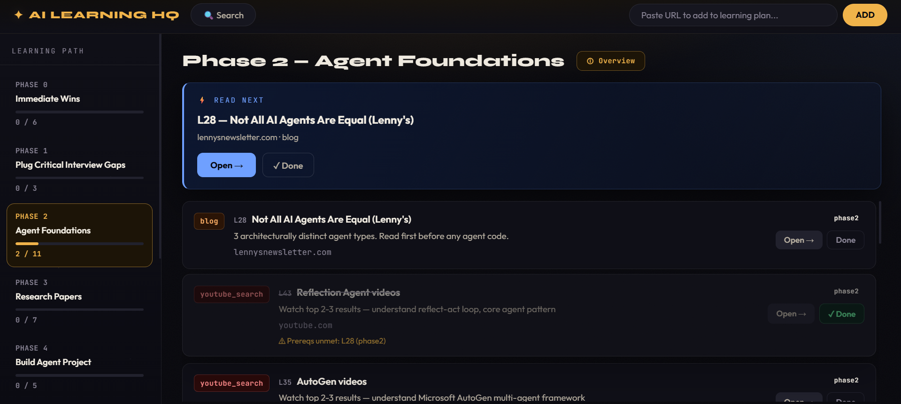

# Learning HQ

**Turn a pile of bookmarks into a learning path you actually finish.** A local, no-key tracker that sequences courses, papers, repos, and videos into phases, tracks your progress, and tells you what to read next — all from one git-friendly `plan.json`, entirely on your machine.

**The twist:** the optional AI (sort your inbox, write study docs) runs in **your own** Claude Code / Codex agent — or a local Ollama model — so there's no shared key, no bill, and nothing leaves your machine.

[](LICENSE)


## Features

- 📚 Organize courses, papers, repos, and videos into **phases** with progress tracking
- ⚡ **Read Next** suggestion per phase; priorities (Now / Soon / Someday)
- 🗂️ **Inbox** for new links — assign phase + priority inline, mark done, delete
- ℹ️ Per-phase **Overview** (summary, goal, milestone, key concepts)
- 🔎 Fast search; one editable, git-friendly `plan.json`
- 🌑 Distinctive dark "Observatory" theme, keyboard-accessible
- 🤖 **Optional** AI (sort + enrich) via your own key or local Ollama — off by default
- 🔒 Runs entirely locally. No account, no cloud, no API key needed.

## Demo


## Screenshot



> _The app runs at http://localhost:3000 after `npm start`. To add the demo GIF, see `assets/README.md`._

## Quick start

```bash
git clone https://github.com/Arrnnnaav/learning-hq.git
cd learning-hq
npm install
npm start
# open http://localhost:3000
```

On first run it seeds `plan.json` from an **AI/ML Engineer** starter curriculum so the app isn't empty. Edit `plan.json` directly, or use the UI: paste a URL to add a resource (it lands in **Inbox**), then set its phase and priority with the dropdowns, mark it done, or delete it.

## Start from scratch

Delete `plan.json` and copy the empty template:

```bash
cp plans/plan.template.json plan.json
```

Then rename the phases and add your own links.

## AI automation (optional)

The app is fully usable on its own. For AI-powered sorting and study-doc generation,
install the companion **Learning HQ plugin** in your own agent (Claude Code or Codex)
and run it from this directory. Generated docs appear behind a 📖 **Study** button on the
relevant link. See the plugin repo for setup.

## Optional AI without an agent

Prefer not to use the plugin? You can run **Auto-sort** and **Re-enrich** directly in the
app with your own OpenAI-compatible endpoint:

1. `cp .env.example .env`
2. Fill in `AI_BASE_URL`, `AI_API_KEY` (blank for Ollama), and `AI_MODEL`.
   - Hosted: `https://api.openai.com/v1` + your key + e.g. `gpt-4o-mini`.
   - Free/local: run [Ollama](https://ollama.com), then `http://localhost:11434/v1` + `llama3.1`.
3. `npm start` (restart if it was running).

When configured, an **✨ Auto-sort** button appears on the Inbox and a **↻** re-enrich
button on each card. Study-doc generation needs live web search — use the plugin for that.
Your key stays in `.env` (git-ignored) and is never sent to the browser.

## Plan format

`plan.json` has two arrays:

- `phases[]` — each `{ id, name, summary, goal, milestone, concepts[] }`. The `summary`/`goal`/`milestone`/`concepts` show in the per-phase **Overview** modal.
- `links[]` — each `{ id, url, title, description, category, phase, priority, done, order }`. `phase` references a phase `id`; `priority` is `Now|Soon|Someday`; `order` sets position within a phase.

An always-present phase with `id: "inbox"` is where newly added links land. See `plans/plan.template.json` for a minimal example and `plans/starter-ai-ml.json` for the full starter.

## Configuration

- `PORT` — server port (default `3000`).
- `PLAN_FILE` — path to your plan (default `./plan.json`).

## Tests

```bash
npm test
```

## Companion plugin

Want AI **sorting** and **study-doc generation** powered by your own agent (Claude Code or
Codex)? Install the companion plugin — it runs in your agent (your subscription) and writes
to the same `plan.json`:

→ **[learning-hq-plugin](https://github.com/Arrnnnaav/learning-hq-plugin)**

## License

[MIT](LICENSE)
